Home Active Directory Lab
=========================

Building AD Home Lab
^^^^^^^^^^^^^^^^^^^^

1. Download Windows Server 2012 from Microsoft: `180-day free trial <https://www.microsoft.com/en-us/evalcenter/evaluate-windows-server-2012-r2>`_

2. Using Virtualbox to set up the Windows Server

The Virtual Network
^^^^^^^^^^^^^^^^^^^

When considering the networking of your virtual lab, it's important to consider what you're trying to achieve. Virtual Networks come in three flavors:

* **NAT**: The virtualization software creates a new virtual network that VMs are a part of. The software acts as a router, natting traffic between the virtual network and the real network that a host computer is associated with. This is the default networking setup for most Virtualization software

* **Host-Only**: The virtualization software creates a new virtual network, but in this case, it does NOT act as a router. VMs in a host-only network can talk among themselves, but their traffic can't leave the host device

* **Bridged**: The virtualization software puts the VM on the same network as the host computer, so the VM acts just like another computer on the network

For this lab, we'll be creating a Host-Only network:

1. In VirtualBox, go to **File > Host network Manager**

2. Click on the **Create** button in the upper left. This will create a new network interface on your computer for VirtualBox

3. Select the new interface, make sure **Properties** is selected from the top of the window and **give it an IP address scheme** that agrees with you

.. image:: ad_lab_virtualbox_network01.png
   :width: 800px
   :height: 600px
   :scale: 100 %
   :alt: alternate text
   :align: center

Now selec the VM that was created and edit its settings to use the network created

.. image:: ad_lab_virtualbox_network02.png
   :width: 800px
   :height: 600px
   :scale: 100 %
   :alt: alternate text
   :align: center
   
Setup Windows 
^^^^^^^^^^^^^

To setup the Domain Controller, we need to do three things:

1. Install the Virtualization Guest Extensions. In VMWare these are called VM Tools, in VirtualBox they're Guest Additions. 

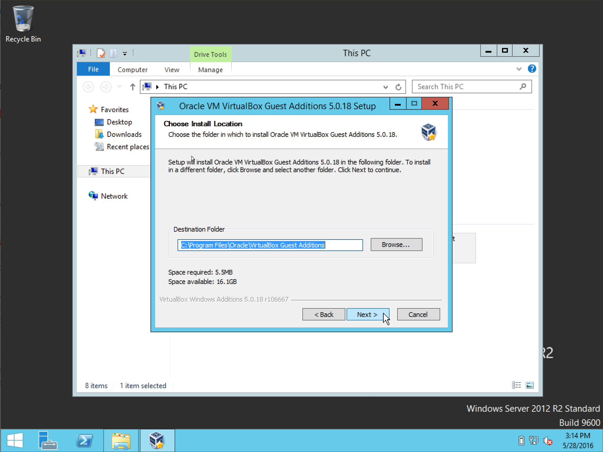

2. Give it a static IP address. The actual address doesn't matter, typically, you'd give the DCs the last IP in the subnet. We're also going to set out gateway to **.2** and use Google's DNS servers for name resolution.

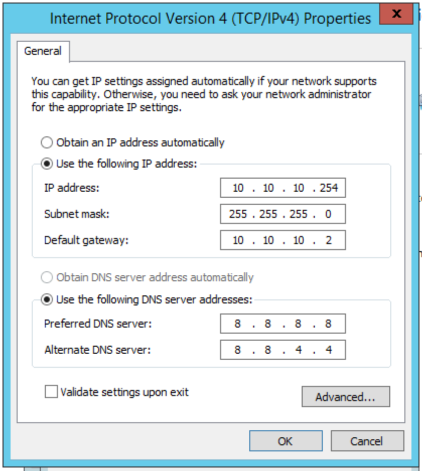

3. Rename the computer something sensible so you'll know what the DC is named

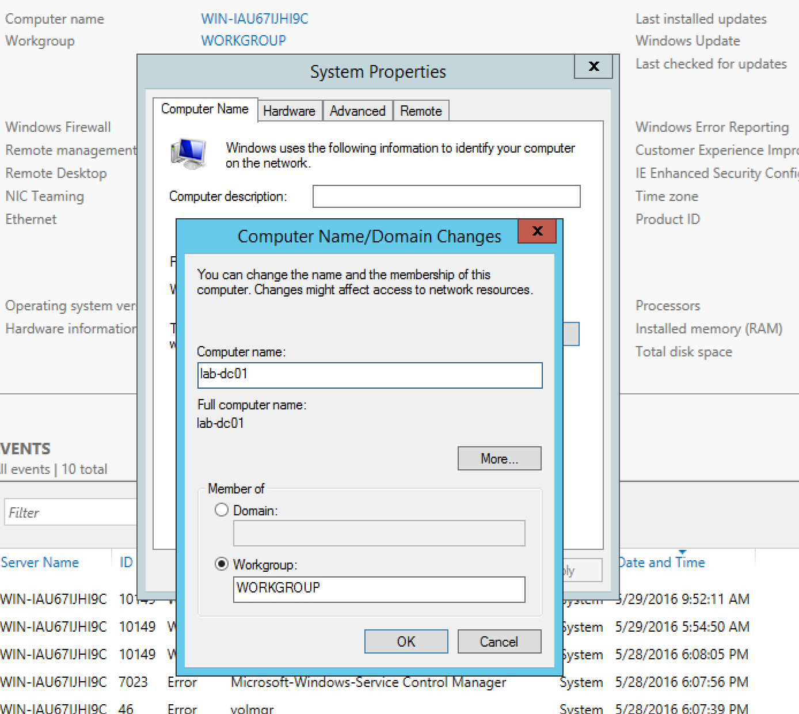

4. Reboot

Installing the Domain Controller Role
^^^^^^^^^^^^^^^^^^^^^^^^^^^^^^^^^^^^^

Installing the ADDS Role
########################

Open up "Server Manager" from the start menu and from the Quick Start, select **Add Roles and Features**

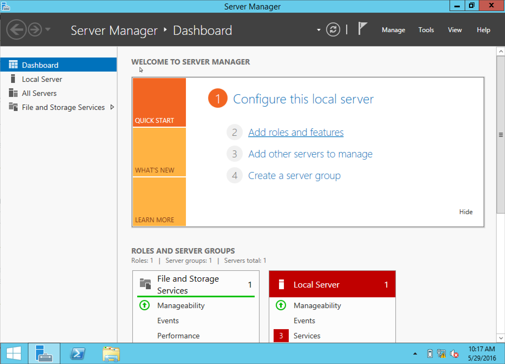

Click next until you reach the step to select roles, select **Active Directory Domain Services** and click **Add Features** to the window that pops up.

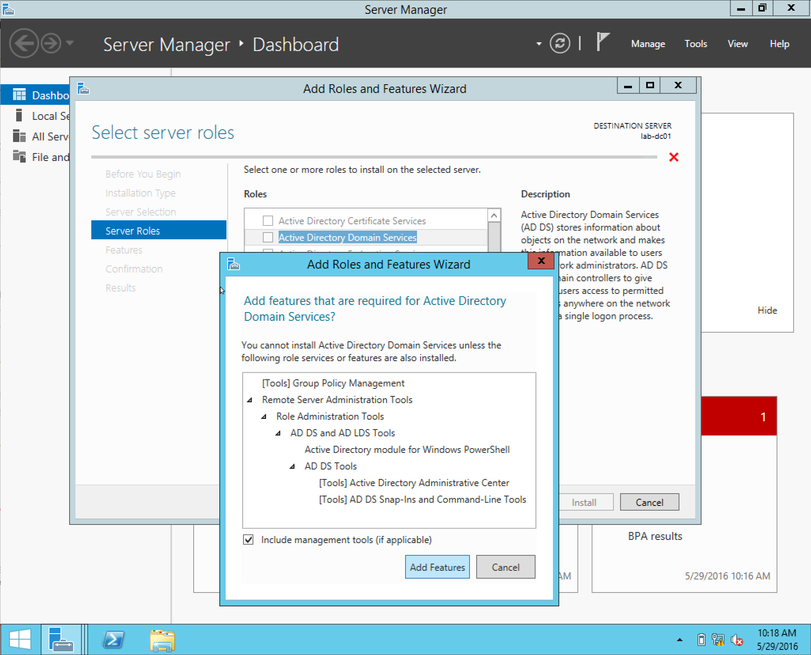

Promoting the Server to a Domain Controller
^^^^^^^^^^^^^^^^^^^^^^^^^^^^^^^^^^^^^^^^^^^

Once the role is installed, you should see a little warning sign in Server Manager, click that and then select **Promote this Server to Domain Controller**

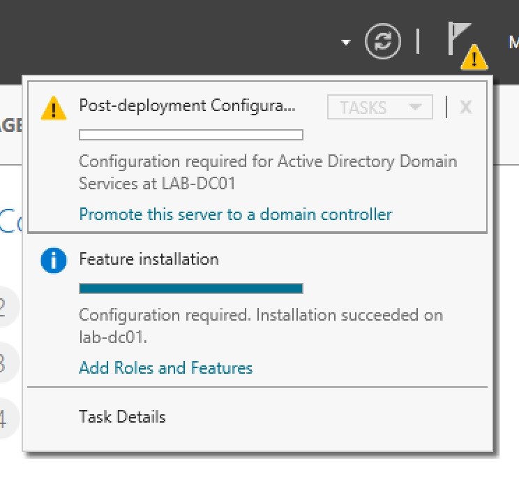

The first thing we're going to have to do is create our forest, so select **New Forest** and enter a domain name. In this example we use "**example.com**"

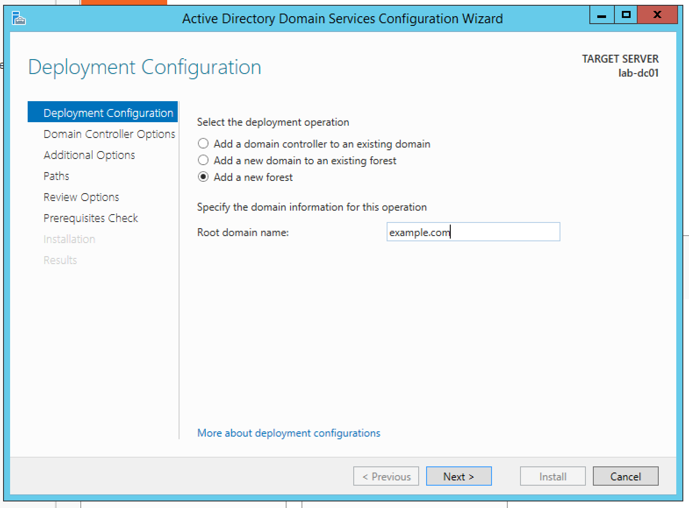

On the next screen we'll leave the defaults and we're going to create a **recovery password**. You will most likely never use this in a lab, its typically used when very bad things happen to your domain.

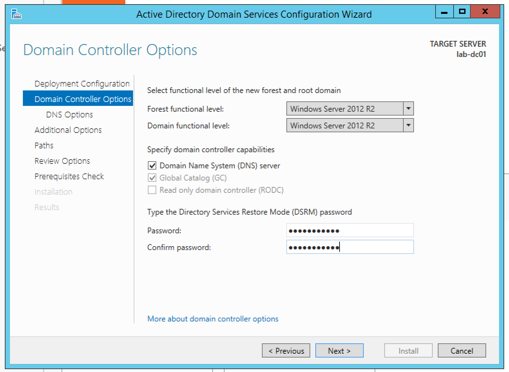

On the next screen, you're going to see this error message. It just means that the server couldn't find an existing DNS infrastructure for the domain you specified earlier. Of course it couldn't because it hasn't been created yet. Click "Next"

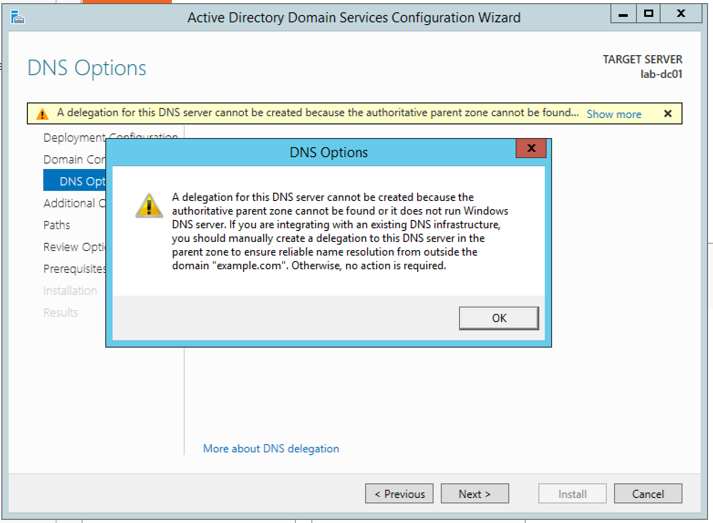

For the next series of prompts, we'll just accept the defaults. It's good enough for the lab (they're also good enough for most production networks too). The wizard will check some pre-requisites and t hen you'll end up at the install screen. There will be some warnings but it's okay. Click "Install"

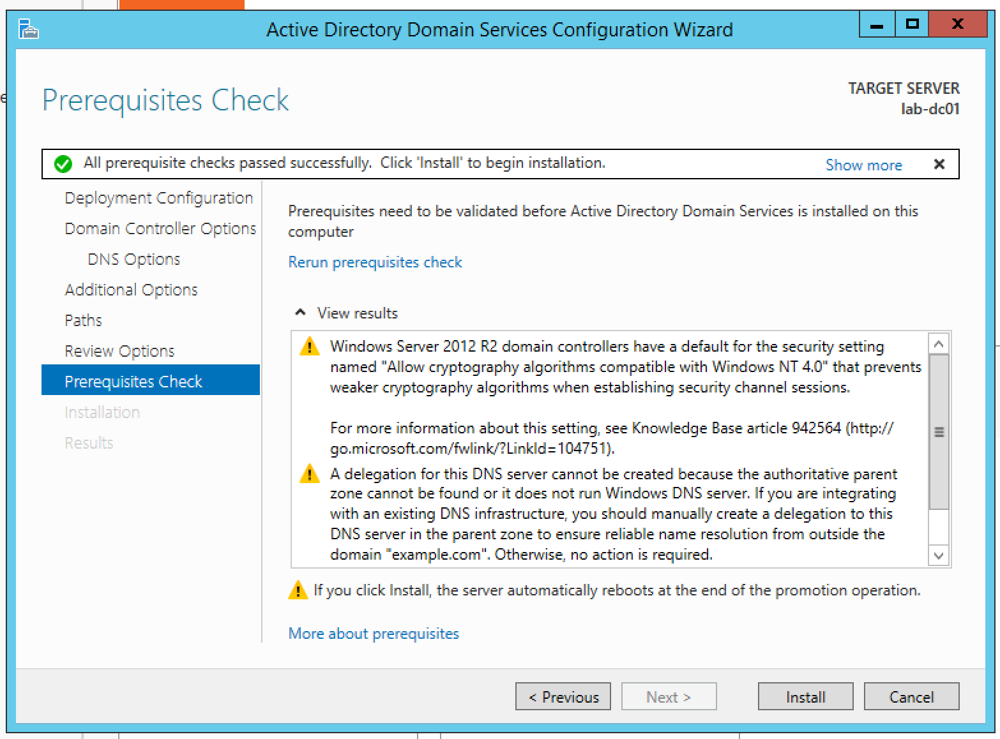

Next Steps?
^^^^^^^^^^^

After the server comes back up, you'll have a domain controller. You can log in using the same Administrator account as before, onyl now it's a **Domain Administrator**. *In interesting characteristic of Domain Controllers* is that there are no longer local accounts on the server. Domain Controllers **are** the domain, they're what host everything that makes the domain work, so the concept of "local accounts" doesn't apply here.

Setup a Firewall
^^^^^^^^^^^^^^^^

In the last steps, a **Host-Only Network** was created for the domain. This is nice because it keeps the miscellaneous domain traffic from crossing over to other networks we're connected to. The downside is that we won't have internet access. We're going to fix this by creating a simple Firewall VM that will handle routing between the Host-Only Network and our Host Computers network. We'll do this by using `PFsense <https://www.pfsense.org/>`_

Building the Firewall VM
########################

Provision a new VM for the Firewall. 1vCPU, 256MB of RAM and 5GB of HDD would be enough. Choose the **FreeBSD 64-bit**

We'll also need to add a second network card to the VM.

1. Go to properties pane for the VM, select the "Network" section.

2. On the first network card tab, make sure that it is set to "NAT"

3. Click the second network card tab, enable the adapter

4. Assign it to the "Host-Only Network" created before.

.. image:: ad_lab_virtualbox_network03.png
   :width: 800px
   :height: 600px
   :scale: 100 %
   :alt: alternate text
   :align: center

PFSense
^^^^^^^

1. `Download the ISO from the website <https://www.pfsense.org/download/>`_

2. When prompted **Press I** to start the Installer. Choose **Accept These Settings** and then **Quick/Easy Install**

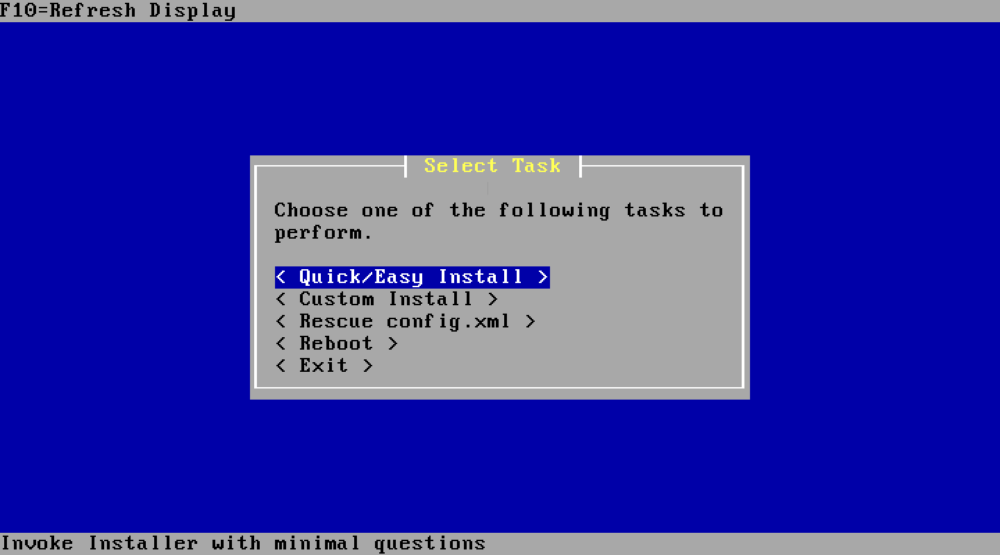
   
3. When prompted, choose **Standard Kernel** and then reboot when prompted. Make sure to **unmount the ISO from the VM** before the machine boots back up

Setting up PFSense
^^^^^^^^^^^^^^^^^^

When PFSense is booted, you'll see:

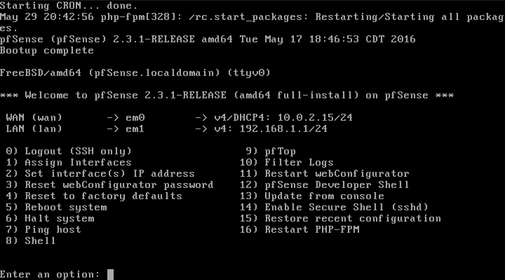
   
We need to configure the LAN interface to work propertly for our Host-Only network. To do this, from the PFSense menu, press `2` to select **Change IP Addressing** and `2` again to select the **LAN Interface**. You'll then run through a series of prompts to setup the router. The following are what you should do:

1. **New LAN IPv4 Address:** The address we give this interface should be the same address you used as the *gateway address* when you setup the IP address on the Domain Controller. In the example, we used 10.10.10.2

2. **New LAN Subnet Bit Counnt**: This depends on how you setup your "Host-Only network", but it's probably 24

3. **Upstream Gateway Address:** Just press enter, don't need an upstream IP for LAN interface.

4. **New LAN IPv6 Address:** Just press enter, we're not using IPv6 for routing.

5. **Enable DHCP Server on LAN?** "N", we want to disable the DHCP server in PFSense.

6. **Revert to HTTP?** "N", we do not want to use HTTP for the admin interface.

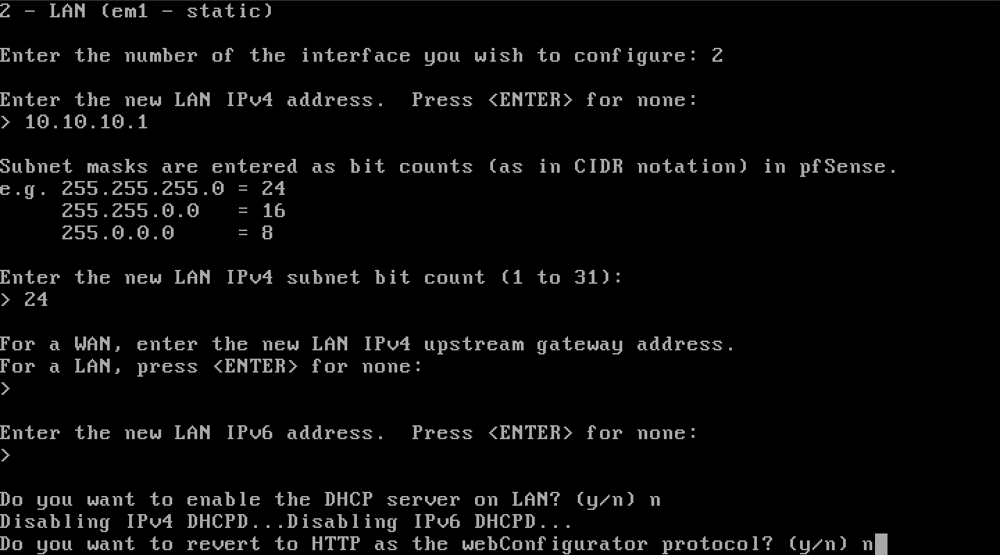
   
Installing DHCP
^^^^^^^^^^^^^^^

Hosting DHCP through a Windows box in Active Directory gives lots of benefits, chief among them being that DHCP leases will automatically be added to our DNS servers.

We can just host DHCP on the Domain Controller. This isn't something you'd typically see in production except for maybe in tiny networks. In a production environment, you typically want your domain controllers dedicated to domain controlling. Adding extra roles to the DCs increases risk, patching overhead and the chance that they're going to crash cause something stupid.

Go back to the DC and start the **Add Role sand Features** wizard again. This time we're adding the DHCP Server Role. When prompted to add the required features, select **Add Features**

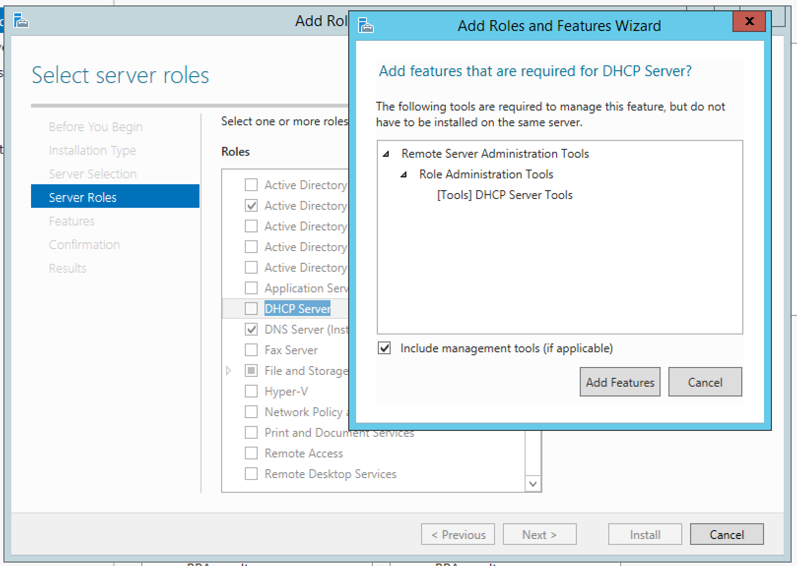
   
After that, keep clicking "Next" until you get the option to "Install", then click that.

Once the install has finished, we can configure the DHCP server by clicking on the "Notification" button in Server Manager and selecting **Complete DHCP configuration**

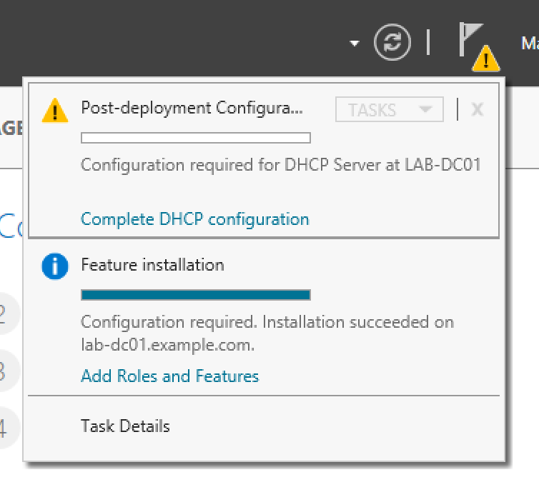
   
Just click Next > Next > Finish.

Configure the DHCP Server
^^^^^^^^^^^^^^^^^^^^^^^^^

1. In **Server Manager** click on the Tools menu in the upper right and select **DHCP**

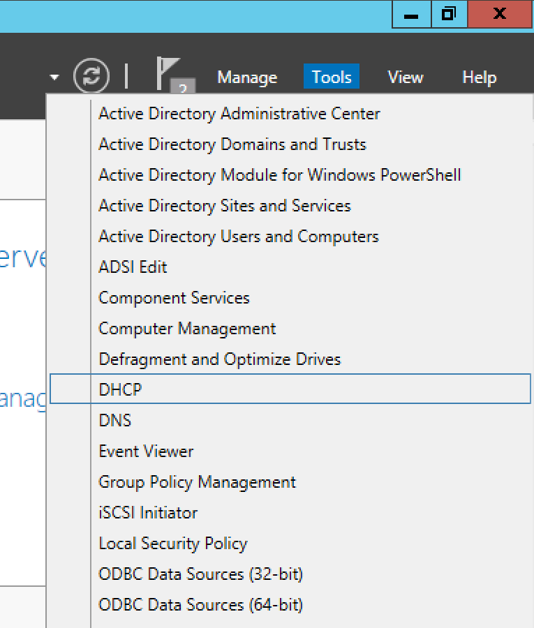

2. Expand your domain on the left-hand side, right click **IPv4** and select **Add New Scope**

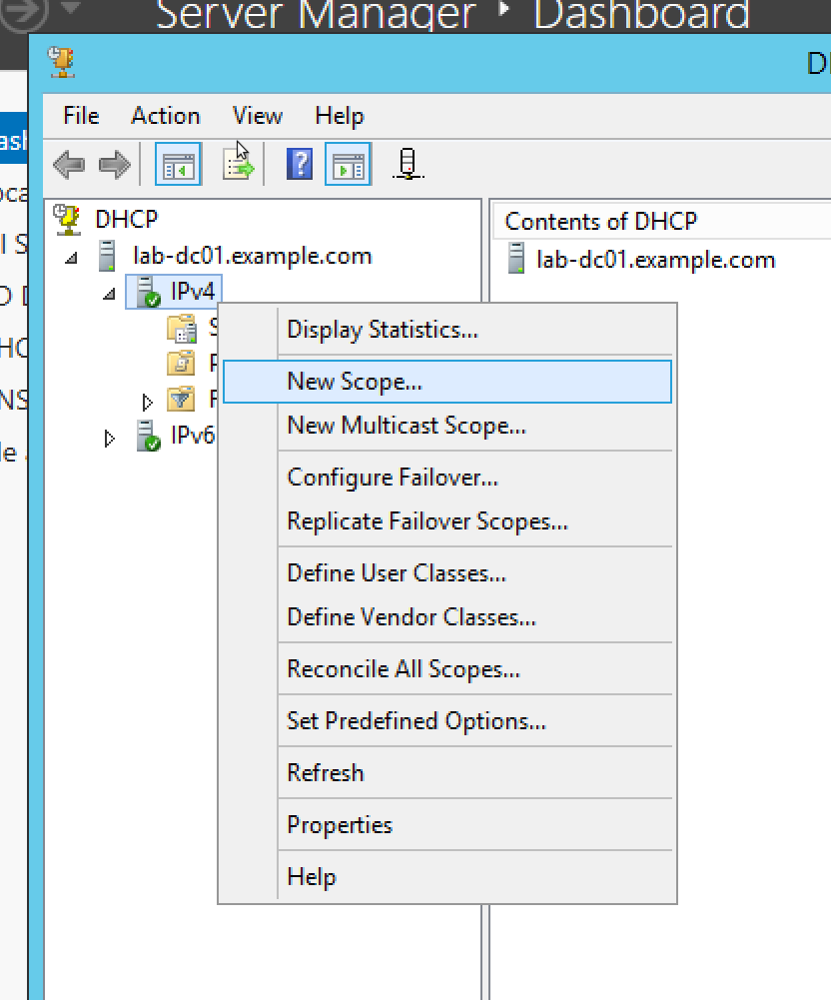

3. Click Next through the Wizard. When prompted, name your DHCP scope whatever you want. This will be "Lab" here

4. When prompted for the scope, create a range of 50 to 100 IPs within your network and set your subnet mask appropriately.

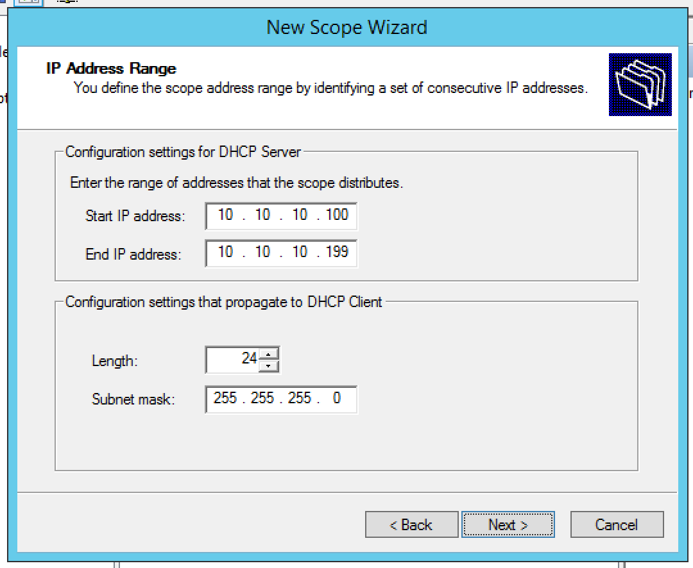

4. Keep clicking next in the wizard, if you're asked if you'd like to set **additional options**, select **yes** and click next.

6. For the router address, **enter the address that you set for the LAN interface on the PFSense VM** (the same address that you put as the default gateway on the Domain Controller). For this lab, we're using `10.10.10.2`. Click **Add** then click next.

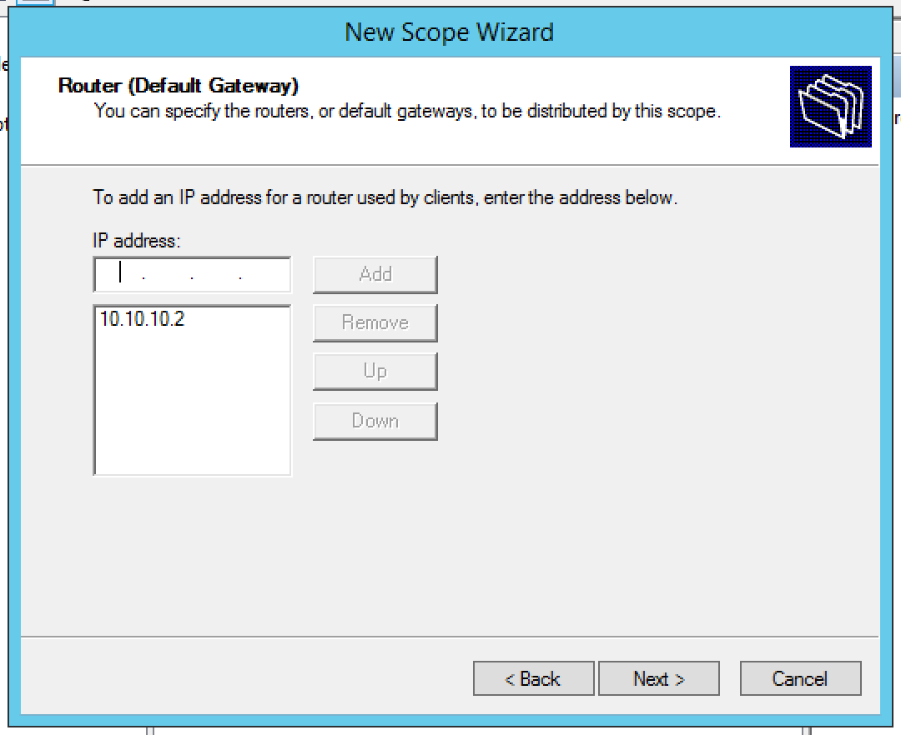

7. Keep clicking **Next** until yuo get to the end of the wizard.

And now??
^^^^^^^^^

We now have a functional lab network. We have a domain, internet, and DHCP is up and running. 

We've created our Domain Controller, address networking, and now we can actually start using the Active Directory. The first thing we'll do is create a new admin user for ourselves. Then we'll add another computer to the domain and then finally we'll create some basic Group Policy settings.

Part 2: :ref:`lab-part-2`.

