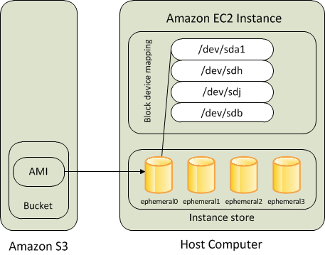
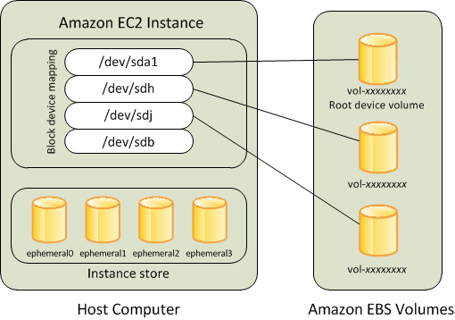
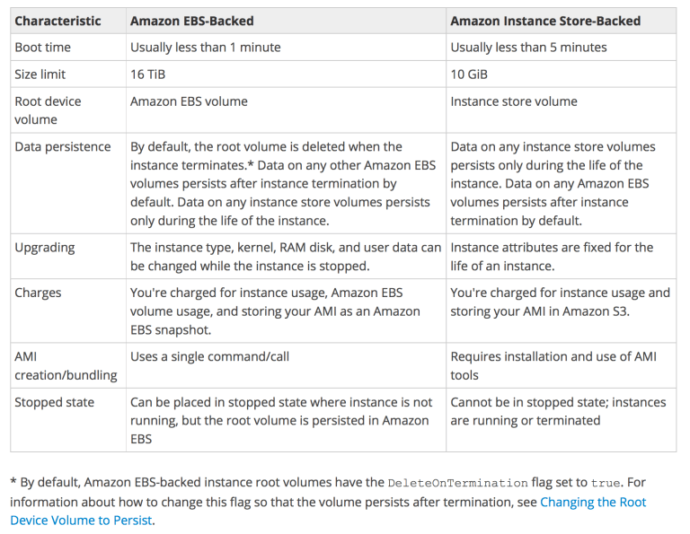

AWS EBS vs Instance Store
=========================

* EC2 instances support two types for block level storage

	* Elastic Block Store (EBS)

	* Instance Store (Ephemeral store)

* EC2 Instances can be launched using either Elastic Block Store (EBS) or Instance Store volume as root volumes and additional volumes.

* EC2 instances can be launched by choosing between AMIs backed by EC2 instance store and AMIs backed by EBS. However, AWS recommends use of EBS backed AMIs, because they launch faster and use persistent storage

Instance Store (Ephemeral storage)
^^^^^^^^^^^^^^^^^^^^^^^^^^^^^^^^^^

* An Instance store backed instance is an EC2 instance using an Instance store as root device volume created from a template stored in S3.

* Instance store volumes accesses storage from disks that are physically attached to the host computer.

* When an Instance stored instance is launched, the image that is used to boot the instance is copied to the root volume (typically sda1).

* Instance store provides temporary block-level storage for instances.

* Data on an instance store volume persists only during the life of the associated instance; if an instance is stopped or terminated, any data on instance store volumes is lost.

Key points for Instance store backed Instance
*********************************************

1. Boot time is slower then EBS backed volumes and usually less then 5 min

2. Can be selected as Root Volume and attached as additional volumes

3. Instance store backed Instances can be of maximum 10GiB volume size

4. Instance store volume can be attached as additional volumes only when the instance is being launched and cannot be attached once the Instance is up and running

5. Instance store backed Instances cannot be stopped, as when stopped and started AWS does not guarantee the instance would be launched in the same host and hence the data is lost

6. Data on Instance store volume is LOST in following scenarios :-

	* Failure of an underlying drive

	* Stopping an EBS-backed instance where instance store are attached as additional volumes

	* Termination of the Instance

7. Data on Instance store volume is NOT LOST when the instance is rebooted

8. For EC2 instance store-backed instances AWS recommends to

	a. distribute the data on the instance stores across multiple AZs

	b. back up critical data from the instance store volumes to persistent storage on a regular basis.

9. AMI creation requires usage on AMI tools and needs to be executed from within the running instance

10. Instance store backed Instances cannot be upgraded

Amazon Elastic Block Store (EBS)
^^^^^^^^^^^^^^^^^^^^^^^^^^^^^^^^

* An “EBS-backed” instance means that the root device for an instance launched from the AMI is an EBS volume created from an EBS snapshot

* An EBS volume behaves like a raw, unformatted, external block device that can be attached to a single instance and are not physically attached to the Instance host computer (more like a network attached storage).

* Volume persists independently from the running life of an instance. After an EBS volume is attached to an instance, you can use it like any other physical hard drive.

* EBS volume can be detached from one instance and attached to another instance

* EBS volumes can be created as encrypted volumes using the EBS encryption feature

Key points for EBS backed Instance
**********************************

1. Boot time is very fast usually less then a min

2. Can be selected as Root Volume and attached as additional volumes

3. EBS backed Instances can be of maximum 16TiB volume size depending upon the OS

4. EBS volume can be attached as additional volumes when the Instance is launched and even when the Instance is up and running

5. Data on the EBS volume is LOST

	a. for EBS Root volume, if Delete On Termination flag is disabled (enabled, by default)

	b. for attached EBS volumes, if the Delete On Termination flag is disabled, which is the default.

6. Data on EBS volume is NOT LOST in following scenarios :-

	* Reboot on the Instance

	* Stopping an EBS-backed instance

	* Termination of the Instance for the additional EBS volumes. Additional EBS volumes are detached with their data intact

7. When EBS-backed instance is in a stopped state, various instance– and volume-related tasks can be done for e.g. you can modify the properties of the instance, you can change the size of your instance or update the kernel it is using, or you can attach your root volume to a different running instance for debugging or any other purpose

8. EBS volumes are AZ scoped and tied to a single AZ  in which created

9. EBS volumes are automatically replicated within that zone to prevent data loss due to failure of any single hardware component

10. AMI creation is easy using a Single command

11. EBS backed Instances can be upgraded for instance type, Kernel, RAM disk and user data

Boot Times
^^^^^^^^^^
* EBS-backed AMIs launch faster than EC2 instance store-backed AMIs.

* When an EC2 instance store-backed AMI is launched, all the parts have to be retrieved from S3 before the instance is available.

* With an EBS-backed AMI is launched, parts are lazily loaded and only the parts required to boot the instance need to be retrieved from the snapshot before the instance is available.

* However, the performance of an instance that uses an EBS volume for its root device is slower for a short time while the remaining parts are retrieved from the snapshot and loaded into the volume.

* When you stop and restart the instance, it launches quickly, because the state is stored in an EBS volume.
