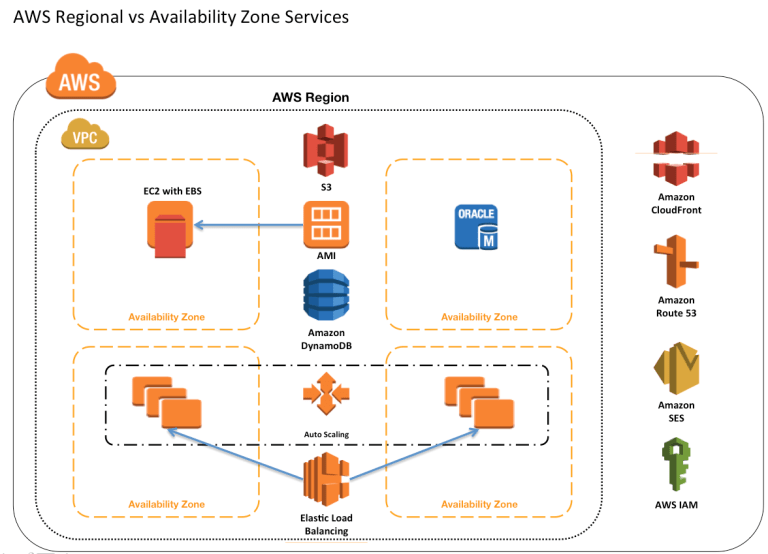

AWS Global vs. Regional vs. AZ resources
========================================

   
IAM

* Users, Groups, Roles, Accounts – Global

	* Same AWS accounts, users, groups and roles can be used in all regions
  
* Key Pairs – **Global** or Regional
	* Amazon EC2 created key pairs are specific to the region

	* RSA key pair can be created and uploaded that can be used in all regions

Virtual Private Cloud

* VPC – **Regional**

	* VPC are created within a region

* Subnet – **Availability Zone**

	* Subnet can span only a single Availability Zone

* Security groups – **Regional**

	* A security group is tied to a region and can be assigned only to instances in the same region.

* VPC Endpoints – **Regional**

	* You cannot create an endpoint between a VPC and an AWS service in a different region.

* VPC Peering – **Regional**

	* VPC Peering can be performed across VPC in the same account of different AWS accounts but only within the same region. They cannot span across regions
* Elastic IP Address – Regional

	* Elastic IP address created within the region can be assigned to instances within the region only

EC2

* Resource Identifiers – **Regional**

	* Each resource identifier, such as an AMI ID, instance ID, EBS volume ID, or EBS snapshot ID, is tied to its region and can be used only in the region where you created the resource.

* Instances – **Availability Zone**

	* An instance is tied to the Availability Zones in which you launched it. However, note that its instance ID is tied to the region.

* EBS Volumes – **Availability Zone**

	* Amazon EBS volume is tied to its Availability Zone and can be attached only to instances in the same Availability Zone.

* EBS Snapshot – **Regional**

	* An EBS snapshot is tied to its region and can only be used to create volumes in the same region and has to be copied from One region to other if needed

* AMIs – **Regional**

	* AMI provides templates to launch EC2 instances

	* AMI is tied to the Region where its files are located with Amazon S3. For using AMI in different regions, the AMI can be copied to other regions

* Auto Scaling – **Regional**

	* Auto Scaling spans across multiple Availability Zones within the same region but cannot span across regions

* Elastic Load Balancer – **Regional**

	* Elastic Load Balancer distributes traffic across instances in multiple Availability Zones in the same region

* Placement Groups – **Availability Zone**

	* Placement groups can be span across Instances within the same Availability Zones

* S3 – Global but Data is Regional

	* S3 buckets are created within the selected region

	* Objects stored are replicated across Availability Zones to provide high durability but are not cross region replicated unless done explicitly

* Route53 – **Global**

	* Route53 services are offered at AWS edge locations and are global

* DynamoDb – **Regional**

	* All data objects are stored within the same region and replicated across multiple Availability Zones in the same region

	* Data objects can be explicitly replicated across regions using cross-region replication

* WAF – **Global**

	* Web Application Firewall (WAF) services protects web applications from common web exploits are offered at AWS edge locations and are global

* CloudFront – **Global**

	* CloudFront is the global content delivery network (CDN) services are offered at AWS edge locations

* Storage Gateway – **Regional**

	* AWS Storage Gateway stores volume, snapshot, and tape data in the AWS region in which the gateway is activated
