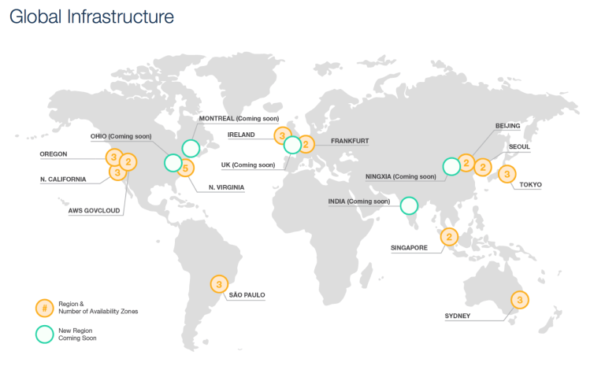

AWS Regions, Availability Zones (AZ) and Edge Locations
=======================================================

Amazon Services are hosted in multiple locations world wide. Amazon provides the ability to place resources and data in multiple locations to improve performance, provide fault tolerance, high availability and cost optimization.

Regions
^^^^^^^

AWS provides customers with the flexibility to place instances and store data within multiple geographic regions called Region. Each region is an independent collection of AWS resources in a defined geography.

* Each region is a separate geographic area and is completely independent

* Each Amazon region is designed to be completely isolated from the other regions & helps achieve the greatest possible fault tolerance and stability

* Communication between regions is across the public Internet and appropriate measures should be taken to protect the data using encryption

* Data transfer between regions is charged at the Internet data transfer rate for both the sending and the receiving instance

* Resources aren’t replicated across regions unless done explicitly

Selection of a Region can be driven from a lot of factors

1. **Latency** – Regions can be selected to be closet to the targeted user base to reduce data latency

2. **Cost** – AWS provides the same set of services across all regions, usually, however the cost would differ from region to region depending upon the cost (due to land, electricity, bandwidth etc) incurred by Amazon and hence can be cheaper in one region compared to the other

3. **Legal Compliance** – Lot of the countries enforce compliance and regulatory requirements for data to reside within the region itself

4. **Features&& – As not all the regions provide all the AWS features and services, the region selection can depend on the Services supported by the region

Availability Zones
^^^^^^^^^^^^^^^^^^

Each Region consists of multiple, isolated locations known as Availability Zones and each Availability Zone runs on its own physically distinct, independent infrastructure and is engineered to be highly reliable.

* Each Region has multiple Availability Zones.

* Each AZ is physically isolated from each other so that an uncommon disaster such as fire, earthquake would only affect a single AZ

* AZs are geographically separated from each other, within the same region, and acts as an independent failure zone

* AZs are redundantly connected to multiple tier-1 transit providers

* AZs in a region are connected with low-latency private links and not through public internet

* Multi-AZ, distribution of resources across multiple Availability Zones, feature can be used to distribute instances across multiple AZ to provide High Availability

* AWS ensures that resources are distributed across the Availability Zones for a region by independently mapping Availability Zones to identifiers for each account. for e.g. us-east-1 region with us-east-1a AZ might not be the same location as us-east-1a AZ for another account. There’s no way for you to coordinate Availability Zones between accounts.

Edge Locations
^^^^^^^^^^^^^^

* Edge locations are locations maintained by AWS through a worldwide network of data centers for the distribution of content.

* These locations are located in most of the major cities around the world and are used by CloudFront (CDN) to distribute content to end user to reduce latency.

