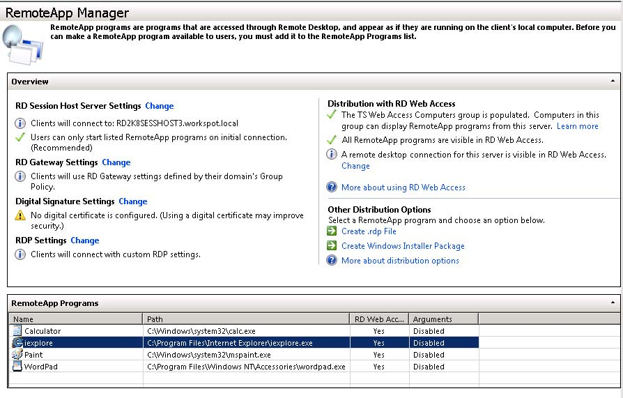
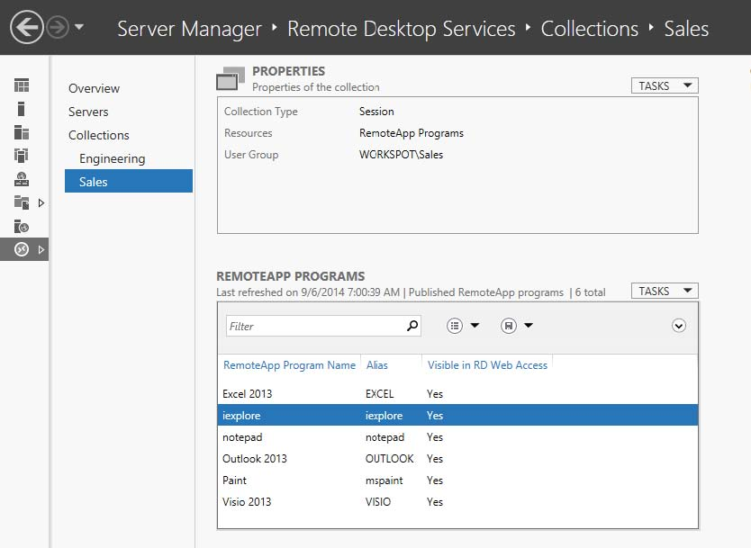
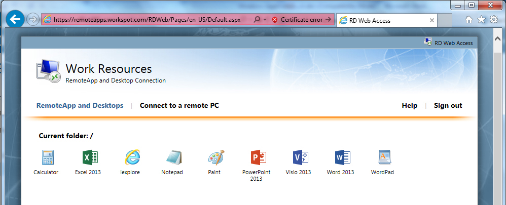

How to Setup Remote Desktop Services (RDS) Web Access
=====================================================

Prerequisites
#############

* Windows Server 2008 R2 or Windows Server 2012 R2 for RemoteApp.

* Windows Server 2008 R2, Windows Server 2012 R2, Windows 7 (32 bit and 64 bit), Windows 8.1 Pro (32 bit and 64 bits) for Remote Desktop.

Remoting Desktops and Applications
^^^^^^^^^^^^^^^^^^^^^^^^^^^^^^^^^^

Remote Desktop is not enabled by default on Windows. The feature must be enabled to allow remote access to a workstation or server. Once enabled, any member of the Administrators group can connect to a desktop. Other users must be placed on a remote access list to gain access. To configure remote access, follow these steps:

For Windows 7 and Windows Server 2008 R2:

	1. In Control Panel, click System and Security, and then click System.
	
For Windows 8.1 Pro and Windows Servere 2012 R2:

	1. Start at the Start Screen, and type in the word "remote".
	
	2. From the options provided as a result of the search, select "Allow remote access to your computer". This opens the System Properties dialog box to the Remote tab.
	
Then follow these steps:

	1. On the System page, click Remote Settings in the left pane. This opens the Systems Properties dialog box to the Remote tab. To disable Remote Desktop, select "Don't Allow Connections To This Computer", and then click OK. Skip the remaining steps.
	
	2. To enable Remote Desktop, you have two options. You can:
	
		* Select "Allow Connections from Computers Running Any Version Of Remote Desktop" to allow connections from any versions of Windows.
		
		* Select "Allow Connections Only From Computers Running Remote Desktop With Network Level Authentication" to allow connections only from Windows 7 or later computers (and computers with secure network authentication).
		
	3. Click Select Users. This displays the Remote Desktop Users dialog box.
	
	4. To grant Remote Desktop access to the user, click Add. This opens the Select Users dialog box. In the Select Users dialog box, click Locations to select the computer or domain in which the users you want to work with are located. Type the name of a user you want to work with in the Enter The Objects Names to Select field, and then click Check Names. If matches are found, select the account you want to use and then click OK. If no matches are found, update the name you entered and try searching again. Repeat this step as necessary, and then click OK.
	
	5. To revoke remote access permissions for a user account, select the account and then click Remote.
	
	6. Click OK twice when you have finished.
	
Publishing RemoteApp on Windows Server 2008 R2
^^^^^^^^^^^^^^^^^^^^^^^^^^^^^^^^^^^^^^^^^^^^^^

To make remote apps accessible, the program must be added to the RemoteApp Program list using the RemoteApp Manager.

Publishing RemoteApp on Windows Server 2012 R2
^^^^^^^^^^^^^^^^^^^^^^^^^^^^^^^^^^^^^^^^^^^^^^

RemoteApps are published using Remote Desktop Services running Windows 2012 R2. As shown below, RemoteApps are usually group in "Collections" to allow various users privileges to be applied efficiently.

Notice that the RDS plug-in of Server Manager replaces the following UI in Windows Server 2008 releases:

	* Remote Desktop Services Manager, or tsadmin
	
	* Remote Desktop Services Configuration, or tsconfig
	
	* Remote Desktop Connection Manager, i.e. Remote Desktop Collection Broker (RDCB) UI
	
	* RemoteApp Manager
	

Once the application is published, it may be verified using the Remote Desktop Web Access (RD Web Access).

For example, https://remoteapps.workspot.com/RDWeb/, is a possible URL for Remote Desktop Web Access (RD Web Access), formerly Terminal Services Web Access (TS Web Access). This enables users to access RemoteApp and Desktop Connection through the Start menu on a computer that is running Windows 7 or through a Web browser. It also provides IT with a good place to test RemoteApp behavior.

Connect to another computer using Remote Desktop Connection [Testing RDP]
^^^^^^^^^^^^^^^^^^^^^^^^^^^^^^^^^^^^^^^^^^^^^^^^^^^^^^^^^^^^^^^^^^^^^^^^^

To connect to a remote computer, that computer must be turned on, it must have a network connection, Remote Desktop must be anabled, you must have network access to the remote computer (this could be through the Internet), and you must have permission to connect. For permission to connect, you must be on the list of users. Before you start a connection, it's a good idea to look up the name of the computer you're connecting to and to make sure Remote Desktop connects are allowed through its firewall.

