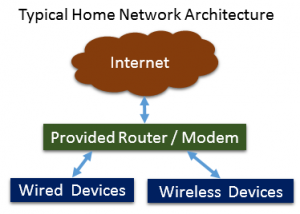
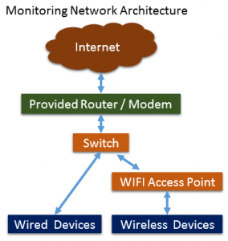
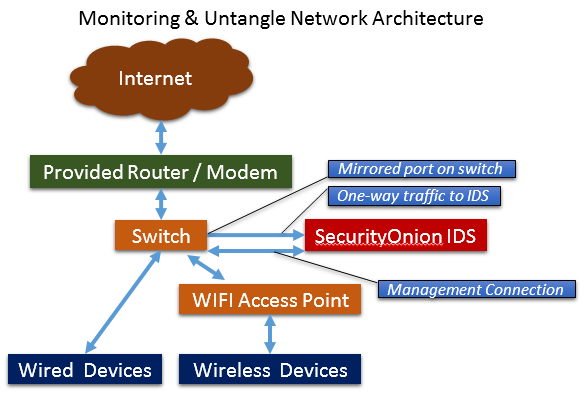

Security Onion Home Setup
=========================

What we want to change our set up to:

We need to set up a switch to use as a mirror port or span. This will allow a user to configure one of the network connections on the switch to be able to hear all the traffic from all the other ports. This is for an Intrusion Detection System (IDS) such as Security Onion since we need to be able to see all the traffic

Example switches:
`Netgear <https://www.amazon.com/gp/product/B0048U3FMS/ref=oh_details_o03_s00_i00?ie=UTF8&psc=1/>`_

Enterprise Switch:
`Cisco <https://www.amazon.com/Cisco-WS-C2950T-24-Catalyst-2950-Switch/dp/B00007MD88/ref=sr_1_2?s=electronics&ie=UTF8&qid=1531604261&sr=1-2&keywords=Cisco+2950/>`_

Next we want to add the SecurityOnion IDS device via a one-way connection to the switch and then set up a secondary connection to that same switch for management traffic to the IDS. If we don't have the second connection, then we can't perform look-ups on systems and get updates on the IDS. You can also plug this management connection right into the router but, if you do, some of the network traffic will not be alerted on. Traffic from the IDS to the Internet will bypass the IDS and this isn't somethign we want.

.. warning::

	Not complete, more to be added..
